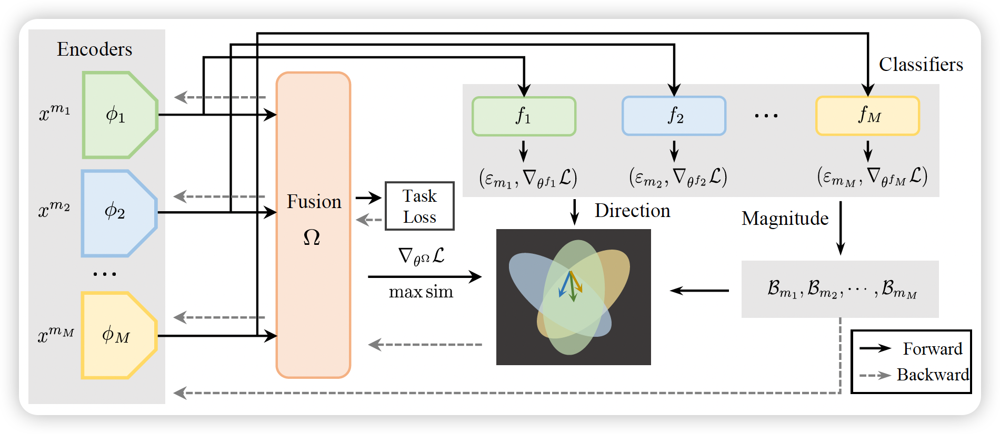

# Classifier-guided Gradient Modulation for Enhanced Multimodal Learning

[NeurIPS 2024] Official PyTorch implementation of the paper "Classifier-guided Gradient Modulation for Enhanced Multimodal Learning"

## Introduction

Multimodal learning has developed very fast in recent years. However, during the multimodal training process, the model tends to rely on only one modality based on which it could learn faster, thus leading to inadequate use of other modalities. Existing methods to balance the training process always have some limitations on the loss functions, optimizers and the number of modalities and only consider modulating the magnitude of the gradients while ignoring the directions of the gradients. To solve these problems, in this paper, we present a novel method to balance multimodal learning with **C**lassifier-**G**uided **G**radient **M**odulation (CGGM), considering both the magnitude and directions of the gradients. We conduct extensive experiments on four multimodal datasets, covering classification, regression and segmentation tasks. The results show that CGGM outperforms all the baselines and other state-of-the-art methods consistently, demonstrating its effectiveness and versatility.




## Getting Started

### Environment

- Python >= 3.8, PyTorch >= 1.8.0

```
git clone https://github.com/zrguo/CGGM.git
```

### Pre-trained Model

For feature extraction of Food 101 dataset, we use pre-trained BERT ([google-bert/bert-base-uncased](https://huggingface.co/google-bert/bert-base-uncased)) and ViT model ([google/vit-base-patch16-224](https://huggingface.co/google/vit-base-patch16-224)).  The pre-trained models are used only in Food 101 dataset.

### Running the Code

Run the python file under the directory `run` according to the dataset.

For example, if you want to evaluate the performance on CMU-MOSI dataset,  you can run the `mosi_run.py` file:

```bash
python mosi_run.py --data_path "mosipath" --modulation "cggm" --batch_size 64 --rou 1.3 --lambda 0.2
```

If you want to evaluate the performance on Food 101 dataset, you can run the `food_fun.py` file:

```bash
python food_run.py --data_path "foodpath" --vit "pre-trained vit path" --bert "pre-trained bert path" --modulation "cggm"
```


## Citation

If you find the repository useful, please cite the following paper:

```bibtex
@inproceedings{guo2024classifier,
title={Classifier-guided Gradient Modulation for Enhanced Multimodal Learning},
author={Guo, Zirun and Jin, Tao and Chen, Jingyuan and Zhao, Zhou},
booktitle={The Thirty-eighth Annual Conference on Neural Information Processing Systems},
year={2024}
}
```


